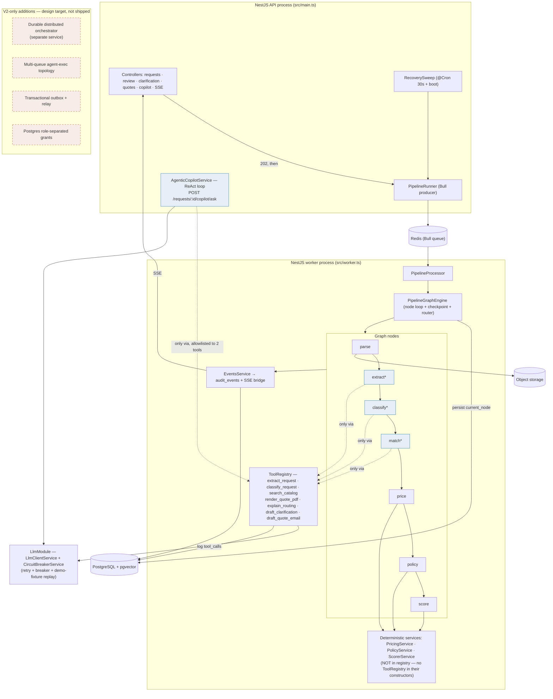
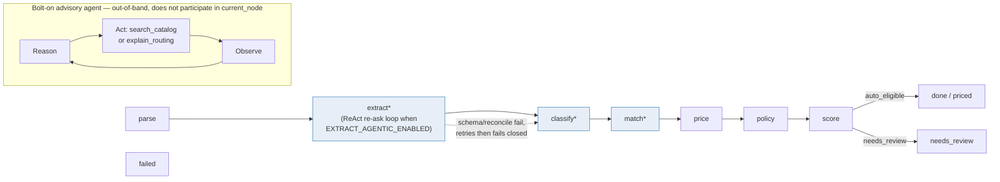

# ARCHITECTURE_V2 — Distill.ai production target

This document names the distributed system Distill.ai's V1 is an honest subset of. Where
`docs/architecture.md` describes the buildable V1 blueprint in implementation detail, this document
sets V1 next to the V2 target it grows into, so a reader can tell in one pass what is running code
today versus what is a named, not-yet-built direction.

**The one-sentence claim:** V1 is an honest, working subset of a distributed target we can name
precisely, not a mockup of a different system.

---

## 1. Executive summary

V1 ships today: an in-process deterministic graph engine driving `parse → extract → classify →
match → price → policy → score → done/failed`, seven real tools behind a validating, logging
`ToolRegistry`, hybrid pgvector + trigram catalog matching, Bull/Redis async processing with
crash-recovery resume, and one bolt-on ReAct-pattern advisory agent that answers free-text questions
about a request without touching the deterministic pipeline. The `extract` node can also hand
retry/accept decisions to a bounded agentic loop instead of a fixed two-attempt policy, behind a
feature flag that defaults off.

V2 adds: a durable distributed orchestrator running as its own service, a multi-queue agent-exec
topology, Postgres role-separated grants enforcing the deterministic/agentic boundary at the
database layer instead of at the application layer, a transactional outbox for guaranteed event
delivery, and shared `LlmClient`/`EmbeddingsClient` port interfaces giving embeddings the same
circuit-breaker/retry/demo-fixture resilience the LLM client already has.

None of the V2 items are required to run V1 end to end today, including the keys-removed demo path
(`docs/demo-checklist.md`) — they are named because the V1 design (same node names, same tool
names, same deterministic/agentic boundary) grows into them without a rewrite, not because V1 is
missing something it needs right now.

A reader who checks out this branch can independently confirm every "In V1" claim below by running
`pnpm test`, starting the app with `DEMO_MODE=true` and no provider keys, and hitting the Swagger UI
at `/api/docs` — nothing in §5's left column depends on a live LLM key or an unmerged idea.

---

## 2. Container diagram



`*` = AI-touched node — reaches the LLM only through `ToolRegistry`. `price`/`policy`/`score` call
plain deterministic services and have no registry access at all. The dashed V2 box on the right is
not wired to anything above it: it is a named target, not a stub that already exists.

### New modules since the V1 blueprint

| Module / file | Owns |
| --- | --- |
| `src/modules/llm/` (`LlmModule`, `LlmClientService`, `CircuitBreakerService`) | Single owner of every LLM call in the app — retry, circuit breaker, demo-fixture replay |
| `src/modules/classify/tools/classify-request.tool.ts` | `classify_request` tool — `ClassifyNode` now goes through `ToolRegistry` the same way `ExtractNode` does, instead of calling `ClassifyService` directly |
| `src/modules/copilot/agentic/` (`agentic-copilot.service.ts`, `agentic-copilot.tools.ts`) | The bolt-on ReAct agent — builds the LangChain agent, wraps `search_catalog`/`explain_routing` as agent tools, enforces the step cap |
| `src/modules/extraction/tools/reconcile-extraction.tool.ts` | Wraps the existing pure `reconcile()` check as a `ToolContract`, so the agentic `extract` loop can call it like any other tool |

Every one of these is a new *caller* of `ToolRegistry` or a new *tool inside* it — none of them
introduce a second registry, a second event bus, or a second persistence path. The single-registry,
single-event-bus shape from `docs/architecture.md` §2/§3 is unchanged.

---

## 3. State-graph and the advisory side-graph



The advisory agent is drawn as a separate, dashed-border side-graph on purpose: it answers a
free-text question about an already-processed request over HTTP, synchronously, and never writes
`current_node` or advances the pipeline. It shares `ToolRegistry` with the pipeline (same audit
logging, same Zod-validated tool contracts) but is a second caller of it, not a new pipeline stage.

`extract*`'s agentic mode is the one AI-touched node whose *internal* decision logic changes: instead
of a hardcoded two-attempt loop, a bounded ReAct loop (`EXTRACT_AGENT_MAX_STEPS`, default `4`)
decides whether to retry `extract_request` with refined instructions or accept a best-effort result.
The fail-closed contract is unchanged either way — `ExtractNode.run()` always returns `{ kind:
'advance', next: classify }`, never `{ kind: 'failed' }`, for a schema or reconciliation miss.
`DEMO_MODE` always takes the deterministic loop regardless of the flag, so the keys-removed
guarantee never depends on a live agentic call.

---

## 4. Deterministic / agentic boundary

| Layer | Mechanism | What it guarantees |
| --- | --- | --- |
| Type-level | `ToolName` is a branded string; `toToolName()` rejects `price`/`policy`/`score` via `RESERVED_NAMES` | These three names can never be registered or invoked as tools, even by a typo |
| Wiring-level | `PriceNode`/`PolicyNode`/`ScoreNode` constructors never receive `ToolRegistry` | Those three nodes have no handle to reach the LLM regardless of what the type system allows elsewhere |
| Test-level | `boundary.spec.ts`'s `score boundary` test reads `ScoreNode`'s constructor param types via `Reflect.getMetadata` and asserts `ToolRegistry`/`ToolCallsActions` are absent; CI fails on regression | Enforced continuously, not just caught in review |
| Consumer-level | The bolt-on advisory agent and the agentic `extract` loop are a second and third caller of the same `ToolRegistry`, each scoped to an explicit tool allowlist (2 tools for the advisory agent; `extract_request` + `reconcile_extraction` for agentic extract) | Adding agentic surfaces doesn't add a path to `price`/`policy`/`score` — those names were never tools to begin with |

The fourth row is new relative to `docs/architecture.md` §12: it's the same three-layer guarantee,
restated to cover the two agentic additions rather than a fourth independent mechanism.

---

## 5. V1-shipped vs. V2-adds

| Area | In V1 (shipped) | Explicitly NOT in V1 (V2 target) |
| --- | --- | --- |
| Orchestration | In-process graph engine (one class, worker process), Bull/Redis queue, `@Cron` recovery sweep | Distributed durable orchestrator as its own service |
| Tools | 7 named tools behind `ToolRegistry`, every invocation validated and logged | Tiered registry + full middleware chain |
| Boundary enforcement | Type + wiring + CI-test layers (§4) | Postgres role-separated grants |
| Events | Written directly to `audit_events`, bridged to SSE | Transactional outbox + relay |
| AI surfaces | 3 deterministic-loop AI-touched nodes, 1 bolt-on ReAct advisory agent, 1 flag-gated agentic re-ask loop | 6-agent topology, sub-agents, sandboxed Code-Act |
| LLM resilience | `LlmClientService`: circuit breaker + retry + demo-fixture replay, never a live call in `DEMO_MODE` | Same resilience pattern generalised to `EmbeddingsClient` behind shared `LlmClient`/`EmbeddingsClient` port interfaces |
| Resumability | Node-level (between nodes) | Sub-node / per-step checkpointing |

---

## 6. Migration-phase summary

1. **LLM module consolidation (shipped).** `LlmClientService`/`CircuitBreakerService` moved into a
   single `LlmModule`; every LLM-backed tool (`extract_request`, `classify_request`,
   `explain_routing`, `draft_clarification`, `draft_quote_email`) migrated off the old fetch-based
   provider onto it, with routing context (`orgId`/`requestId`) threaded through `ToolRegistry` end
   to end.
2. **Bolt-on advisory agent (shipped).** The first real Think→Act→Observe loop in the app: a
   free-text Q&A endpoint scoped to two existing tools, gated by `AGENTIC_COPILOT_ENABLED` (default
   `false`), with a step cap so an ungated reasoning loop can't become unbounded LLM spend.
3. **Agentic `extract` (shipped, flag-gated).** The node's fixed retry policy becomes a model
   decision, reusing the same tool-calling infrastructure as the advisory agent; `EXTRACT_AGENTIC_ENABLED`
   defaults `false` and is bypassed entirely in `DEMO_MODE`.
4. **Durable distributed orchestrator (not started).** Unlocked once request volume exceeds what one
   worker process and a single Bull queue can serialize through — a scale threshold this
   single-host deployment hasn't hit, not a missing feature for the current load.
5. **Postgres role-separated grants (not started).** Unlocked once a second, less-trusted class of
   database consumer exists; today the application role is the only consumer, so type/wiring/CI
   enforcement (§4) already closes the gap at zero infra cost.
6. **Transactional outbox (not started).** Unlocked once an external system needs guaranteed
   at-least-once event delivery; today's direct-write-then-SSE-bridge is sufficient because the only
   consumer is the same process that wrote the event.
7. **`LlmClient`/`EmbeddingsClient` port interfaces (not started).** Unlocked once the embeddings
   path needs the same resilience parity the LLM client already has; the catalog-matching embeddings
   call hasn't shown the failure modes that motivated the LLM client's circuit breaker.

---

## 7. Config & flags added since V1's initial cut

```env
AGENTIC_COPILOT_ENABLED=false      AGENTIC_COPILOT_MAX_STEPS=4
EXTRACT_AGENTIC_ENABLED=false      EXTRACT_AGENT_MAX_STEPS=4
```

Both `*_ENABLED` flags default `false` deliberately — each new agentic surface is something this
team chooses to switch on for a specific run, not something that's on by default the moment it
merges. Both `*_MAX_STEPS` values bound an LLM reasoning loop to a hard step count: an ungated
Think→Act→Observe loop over user-supplied or ambiguous input is unbounded LLM spend and unbounded
latency, so neither loop runs without a ceiling. `EXTRACT_AGENTIC_ENABLED` is additionally
short-circuited off whenever `DEMO_MODE=true`, so the keys-removed guarantee never depends on the
newer, less-exercised code path.

---

## 8. Testing the new surfaces

| Suite | Covers | Key assertion |
| --- | --- | --- |
| `tools.spec.ts` (`ToolCallContext threading`) | `ToolRegistry.invoke()` threading `{ orgId, requestId }` into `execute()`, and re-throwing `CircuitBreakerOpenError` instead of swallowing it | A circuit-breaker-open attempt still writes its audit log row before propagating, so it's never invisible in the `tool_calls` trail |
| `llm-client.service.spec.ts` (`HALF_OPEN probe resolution`) | The circuit breaker's HALF_OPEN → OPEN/CLOSED transition on a probe result | A non-transient failure during a probe still releases the probe lock, instead of leaving every other caller blocked until the lock's TTL expires |
| `llm-client.service.spec.ts` (`DEMO_MODE` fixture replay) | The keys-removed guarantee at the client level | Fixture replay happens even when the circuit breaker is CLOSED — `DEMO_MODE` never depends on a live call succeeding or failing first |
| `classify.service.spec.ts` (re-ask on malformed response) | Classification's resilience to a single bad LLM completion | One re-ask on an unparseable response before defaulting to `service_quote`, without retrying a `CircuitBreakerOpenError` |
| `agentic-copilot.service.spec.ts` | The bolt-on agent's guard rails | Disabled → 404 before any LLM construction; demo mode → fixture, no live call; enabled → real agent call with a bounded step count |
| `boundary.spec.ts` (`score boundary`) | The deterministic/agentic boundary (§4) | `ScoreNode`'s constructor has no `ToolRegistry`/`ToolCallsActions` param — unchanged by either new agentic surface |

---

## 9. Where to look

| Question | Source |
| --- | --- |
| Full V1 implementation detail (types, engine loop, tool registry code) | [architecture.md](architecture.md) |
| Keys-removed demo guarantee and how to verify it | [demo-checklist.md](demo-checklist.md) |
| Judge-facing differentiators | [PRD.md](PRD.md) |
