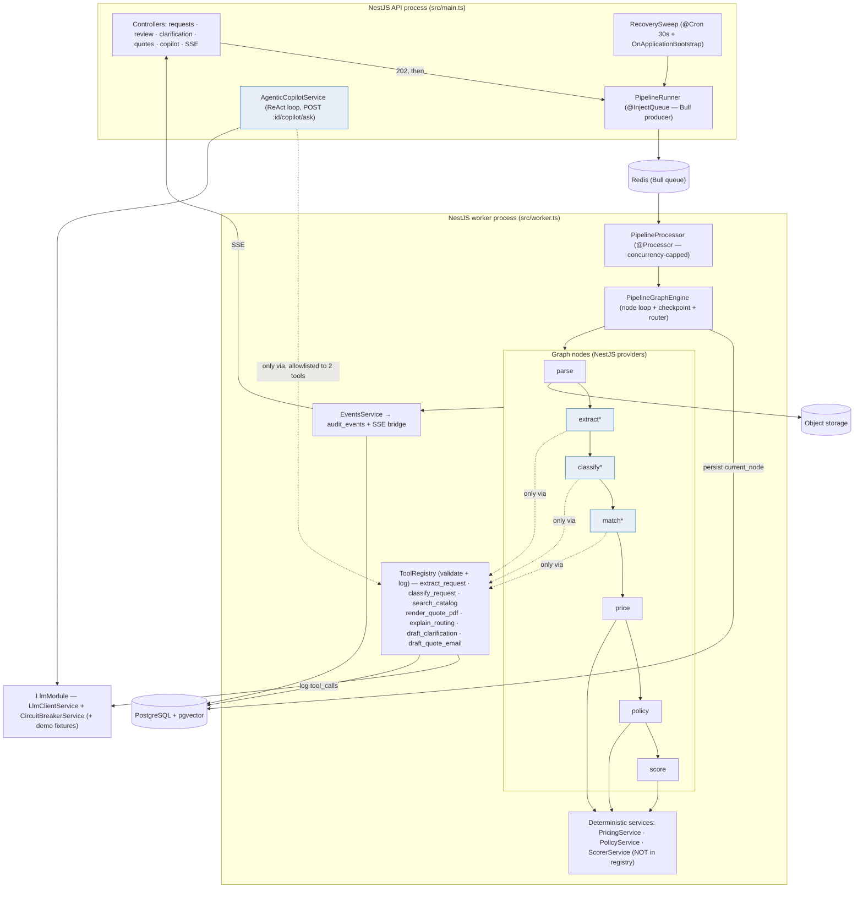

# NestJS Implementation Blueprint — Distill.ai **V1 MVP**

> **See [ARCHITECTURE_V2.md](ARCHITECTURE_V2.md) for the production target this V1 is a subset of.**
> This document stays the implementation-detail reference for V1; the newer doc is the
> executive-level comparison of what's shipped against what's still a named design target.

The buildable plan for the 3-week MVP. Scoped to exactly what M1–M5 ships: a **modular monolith** with a Bull/Redis-backed pipeline queue, a 7-tool registry with logged invocations, crash recovery via a cron sweep, deterministic pricing/policy/scoring, and SSE live trace.

> **This is not the V2 blueprint.** [ARCHITECTURE_V2.md](ARCHITECTURE_V2.md) describes a durable distributed orchestrator, a multi-queue agent-exec topology, a separate agent-runtime service, a tiered harness with a middleware chain, a transactional outbox, and Postgres role-grant boundary enforcement. **Build none of that for V1.** Where the two differ, this document wins for the MVP. The V1 design is an honest subset — same `NodeName` set, same tool names, same deterministic/agentic boundary — that grows into V2 without rework.

---

## 1. Scope guardrails (read first)

| In V1 | Explicitly NOT in V1 (deferred to V2) |
| --- | --- |
| In-process graph engine (one TS class, runs in worker process) | Distributed/durable orchestrator as a service |
| Bull / Redis queue + `@Cron` recovery sweep | Multi-queue agent-exec topology |
| 7 named tools, validate + log on invoke | Tiered tool registry + full middleware chain |
| Module encapsulation enforces the boundary | Postgres role-separated grants |
| Events written directly to `audit_events` | Transactional outbox + relay |
| 3 AI-touched nodes (extract, classify, match), a bolt-on ReAct advisory agent (`copilot/ask`), and a flag-gated agentic `extract` re-ask loop | 6-agent topology, sub-agents, sandboxed Code-Act |
| Node-level resumability (between nodes) | Sub-node / per-step checkpointing |

If a ticket asks for anything in the right column, it's mis-scoped — check it against the backlog's "Explicitly rejected" table.

---

## 2. Runtime shape


```mermaid
flowchart TB
    subgraph API["NestJS API process (src/main.ts)"]
        CTRL["Controllers: requests · review · clarification · quotes · copilot · SSE"]
        PROD["PipelineRunner (@InjectQueue — Bull producer)"]
        SWEEP["RecoverySweep (@Cron 30s + OnApplicationBootstrap)"]
        AGENT["AgenticCopilotService (ReAct loop, POST :id/copilot/ask)"]
    end
    REDIS[("Redis (Bull queue)")]
    subgraph WORKER["NestJS worker process (src/worker.ts)"]
        PROC["PipelineProcessor (@Processor — concurrency-capped)"]
        ENGINE["PipelineGraphEngine (node loop + checkpoint + router)"]
        REG["ToolRegistry (validate + log) — extract_request · classify_request · search_catalog\nrender_quote_pdf · explain_routing · draft_clarification · draft_quote_email"]
        subgraph NODES["Graph nodes (NestJS providers)"]
            N1["parse"] --> N2["extract*"] --> N3["classify*"] --> N4["match*"] --> N5["price"] --> N6["policy"] --> N7["score"]
        end
        DET["Deterministic services: PricingService · PolicyService · ScorerService (NOT in registry)"]
        EV["EventsService → audit_events + SSE bridge"]
    end
    LLMMOD["LlmModule — LlmClientService + CircuitBreakerService (+ demo fixtures)"]
    PG[("PostgreSQL + pgvector")]
    OBJ[("Object storage")]

    CTRL -->|"202, then"| PROD
    SWEEP --> PROD
    PROD --> REDIS --> PROC --> ENGINE --> NODES
    N2 -.->|"only via"| REG
    N3 -.->|"only via"| REG
    N4 -.->|"only via"| REG
    AGENT -.->|"only via, allowlisted to 2 tools"| REG
    REG --> LLMMOD
    AGENT --> LLMMOD
    N5 --> DET
    N6 --> DET
    N7 --> DET
    ENGINE -->|"persist current_node"| PG
    REG -->|"log tool_calls"| PG
    NODES --> EV --> PG
    EV -->|"SSE"| CTRL
    N1 --> OBJ

    classDef ai fill:#e8eef7,stroke:#2E7EB8;
    class N2,N3,N4,AGENT ai;
```

`*` = AI-touched node (reaches the LLM, but **only** through the registry). `price`/`policy`/`score` call plain deterministic services and have **no** registry access.

---

## 3. Module map (V1)

| Module | Epic | Key providers / controllers | Notes |
| --- | --- | --- | --- |
| `CommonModule` | E8 | `Db` (typed SQL), `ConfigService`, `ZodValidationPipe`, `Clock`, `Ids` | shared infra |
| `PipelineModule` | E8 | `PipelineGraphEngine`, `PipelineRunner`, `RecoverySweep`, `NodeRegistry` | the engine — built first |
| `ToolsModule` | E8 | `ToolRegistry`, `ToolInvocationError` | tools register themselves from their owning module |
| `EventsModule` | E7 | `EventsService`, `SseGateway` | writes `audit_events`, bridges sanitized events to SSE |
| `IngestionModule` | E1 | `RequestsController`, `IngestionService`, `ObjectStore` | `POST /v1/requests`, persistence, `current_node='parse'` |
| `ParserModule` | E1 | `ParseNode`, `DocumentParser` | parse node → `parsed_text` |
| `ExtractionModule` | E2 | `ExtractNode`, `extract_request` tool, `ExtractionV1` schema, `reconcile()` | the bounded loop |
| `ClassifyModule` | E2 | `ClassifyNode`, `classify_request` tool, `ClassifyService` | standalone: classify lives outside ExtractionModule; `ClassifyNode` goes through `ToolRegistry` via the `classify_request` tool, same pattern as `ExtractNode` |
| `CatalogModule` | E3 | `MatchNode`, `search_catalog` tool, `VectorStore` port, `CatalogController` | hybrid match |
| `PricingModule` | E4 | `PriceNode`, `PolicyNode`, `PricingService`, `PolicyService` | pure code, no tools |
| `ScoringModule` | E5 | `ScoreNode`, `ScorerService`, `explain_routing` tool | deterministic routing source; the tool is advisory-only, called after routing is decided |
| `RequestsModule` | E6 | `RequestsController`, `ReviewService` | re-map, approve, decline, **resume** |
| `ClarificationModule` | E6 | `ClarificationController`, `ClarificationService`, `draft_clarification` tool | human-gated draft |
| `QuotesModule` | E6 | `QuotesController`, `QuoteRenderer`, `render_quote_pdf` tool, `draft_quote_email` tool | PDF + follow-up email draft |
| `CopilotModule` | E6 | `explain_routing` consumer endpoint, `AgenticCopilotService` (bolt-on ReAct Q&A, `POST :id/copilot/ask`) | advisory-explanation endpoint is read-only; the ReAct agent is a second, allowlisted `ToolRegistry` caller behind `AGENTIC_COPILOT_ENABLED` |
| `AnalyticsModule` | E7 | `AnalyticsController` | KPI reads from `audit_events` |
| `LlmModule` | E2/E3 | `LlmClientService`, `CircuitBreakerService` (+ demo-fixture replay) | single owner of every LLM call — retry, circuit breaker, keys-removed resilience |
| `AuthModule` | NFR-SEC-5 | `RbacGuard` (config-gated) | inert when `AUTH_ENABLED=false` |

---

## 4. Core types

```ts
// src/modules/requests/enums/current-node.enum.ts
export enum CurrentNode {
  PARSE = 'parse', EXTRACT = 'extract', CLASSIFY = 'classify',
  MATCH = 'match', PRICE = 'price', POLICY = 'policy', SCORE = 'score',
  DONE = 'done', FAILED = 'failed',
}

// src/modules/pipeline/types.ts
export interface ErrorInfo { message: string; code?: string; }

// Discriminated on `kind` — avoids ambiguity between terminal and non-terminal advance results.
export type NodeResult =
  | { kind: 'advance'; next: CurrentNode }   // normal transition (including score -> done)
  | { kind: 'clarify' }                      // interrupt: wait for human-gated clarification
  | { kind: 'failed'; error: ErrorInfo };    // infra error only; logical errors flow to score

// Both requestId and orgId are required — nodes need orgId for multi-tenant model-action lookups.
export interface NodeContext { requestId: string; orgId: string; }

export interface PipelineNode {
  readonly name: CurrentNode;
  run(ctx: NodeContext): Promise<NodeResult>;
}

// Branded string enforces the boundary at compile time; toToolName() rejects reserved names.
export const RESERVED_NAMES = new Set(['price', 'policy', 'score']);
export type ToolName = string & { readonly __brand: unique symbol };
export function toToolName(name: string): ToolName {
  if (RESERVED_NAMES.has(name.toLowerCase())) throw new Error(`'${name}' is a reserved tool name`);
  return name as ToolName;
}
// price / policy / score are deliberately NOT ToolNames — the boundary is the type, not a runtime check.
export const TOOL_NAMES = ['extract_request', 'classify_request', 'search_catalog', 'render_quote_pdf', 'explain_routing'] as const;
```

`TOOL_NAMES` is a documentation/reference list, not a runtime whitelist — `toToolName()` only rejects the three reserved names above. `draft_clarification` and `draft_quote_email` are two more real, registered tools (owned by `ClarificationModule`/`QuotesModule`) that aren't listed in this particular array; the app has 7 registered tools in total, not the 5 named here.

---

## 5. The pipeline-graph-engine (E8 / US-E8-4)

The whole orchestrator is this class plus a Bull producer (API process) and a `@Processor` that drives it in the worker process.

```ts
// src/modules/pipeline/graph.engine.ts
@Injectable()
export class PipelineGraphEngine {
  constructor(
    private readonly nodes: NodeRegistry,
    private readonly requests: RequestModelAction,
    private readonly events: EventsService,
  ) {}

  async run(requestId: string): Promise<void> {
    const req = await this.requests.get({ identifierOptions: { id: requestId } });
    if (!req) return;
    const orgId = req.org_id;

    if (req.current_node !== CurrentNode.PARSE) {
      await this.events.emit({ eventName: 'request.resumed', orgId, requestId,
        attributes: { resumed_from_node: req.current_node, reason: 'crash_recovery' } });
    }
    await this.requests.markProcessing(requestId);       // sets processing_started_at for the sweep

    let node = req.current_node;
    let steps = 0;

    while (node !== CurrentNode.DONE && node !== CurrentNode.FAILED) {
      if (++steps > MAX_NODE_TRANSITIONS) { /* guard against infinite loops */ break; }
      const impl = this.nodes.get(node);
      await this.emitNodeEntered(requestId, node, orgId);

      let result: NodeResult;
      try {
        result = await impl.run({ requestId, orgId });         // node writes its OWN outputs via its own model-actions
      } catch (err) {
        const infra = isInfraError(err);
        await this.events.emit({ eventName: 'stage.error', orgId, requestId,
          attributes: { node, escalated_to_human: !infra, error: (err as Error).message } });
        // Infra errors terminate as FAILED; logical errors route to NEEDS_REVIEW via finalize
        const status = infra ? RequestStatus.FAILED : RequestStatus.NEEDS_REVIEW;
        return this.finalize(orgId, requestId, status, startedAt);
      }

      if (result.kind === 'clarify') {
        return this.finalize(orgId, requestId, RequestStatus.NEEDS_CLARIFICATION, startedAt);
      }
      if (result.kind === 'failed') {
        await this.checkpoint(requestId, CurrentNode.FAILED);
        return this.finalize(orgId, requestId, RequestStatus.FAILED, startedAt);
      }

      // kind === 'advance': checkpoint BETWEEN nodes, then continue
      await this.checkpoint(requestId, result.next);
      node = result.next;
    }

    const terminalStatus = await this.computeTerminalStatus(requestId, node);
    await this.finalize(orgId, requestId, terminalStatus, startedAt);
  }

  private async checkpoint(requestId: string, next: CurrentNode): Promise<void> {
    await this.requests.setCurrentNode(requestId, next);
  }

  private async computeTerminalStatus(requestId: string, endNode: CurrentNode): Promise<RequestStatus> {
    if (endNode === CurrentNode.FAILED) return RequestStatus.FAILED;
    // Re-fetch: score node writes routing during this run; the entry-loaded req still has routing: null.
    const req = await this.requests.get({ identifierOptions: { id: requestId } });
    return req?.routing === RequestRouting.AUTO_ELIGIBLE ? RequestStatus.PRICED : RequestStatus.NEEDS_REVIEW;
  }
}
```

Resumability is the `current_node` checkpoint written inside the transaction **before** the next node runs: a crash between nodes loses nothing; a crash mid-node re-runs that node, which each node is written to tolerate (see `ExtractNode` below). That's **node-level** resumability — stated as the limit, not hidden.

Bull queue (Redis-backed) — producer in the API process, processor in the worker:

```ts
// src/modules/pipeline/pipeline.runner.ts
@Injectable()
export class PipelineRunner {
  constructor(
    @InjectQueue(QUEUES.PIPELINE) private readonly queue: Queue,
  ) {}

  /** Enqueues a request for pipeline processing; idempotent via Bull jobId. */
  async enqueue(requestId: string): Promise<void> {
    await this.queue.add(
      PIPELINE_JOBS.RUN,
      { requestId },
      { jobId: `pipeline:${requestId}` }, // Bull deduplicates — safe to call on crash recovery
    );
  }
}
```

```ts
// src/queue/processors/pipeline.processor.ts
@Processor(QUEUES.PIPELINE)
export class PipelineProcessor {
  constructor(private readonly engine: PipelineGraphEngine) {}

  @Process({ name: PIPELINE_JOBS.RUN, concurrency: Number(process.env.PIPELINE_CONCURRENCY ?? 3) })
  async handle(job: BullJob<{ requestId: string }>): Promise<void> {
    await this.engine.run(job.data.requestId);
  }
}
```

Add `QUEUES.PIPELINE = 'pipeline'` and `PIPELINE_JOBS.RUN = 'pipeline:run'` to `src/common/constants/queue.constants.ts`.

Crash recovery (E8 / US-E8-4-T3, wired to real nodes in US-E2-6):

```ts
// src/modules/pipeline/recovery.sweep.ts
@Injectable()
export class RecoverySweep {
  constructor(private db: Db, private runner: PipelineRunner) {}

  @Cron('*/30 * * * * *')
  async sweep() {
    const stale = await this.db.requests.staleParsing(60); // status='parsing' AND processing_started_at < now()-60s
    for (const r of stale) await this.runner.enqueue(r.id);
  }

  @OnApplicationBootstrap()
  async onBoot() { await this.sweep(); } // resume anything left mid-flight by a crash
}
```

---

## 6. Nodes: deterministic vs AI-touched

**Deterministic node — `price` (E4). Calls a pure service. No registry access exists.**

```ts
// src/modules/pricing/price.node.ts
@Injectable()
export class PriceNode implements PipelineNode {
  readonly name = 'price' as const;
  constructor(private db: Db, private pricing: PricingService) {}   // note: no ToolRegistry injected

  async run({ requestId }: { requestId: string }): Promise<NodeResult> {
    const lines = await this.db.lineItems.matched(requestId);
    const priced = this.pricing.price(lines);     // pure function, unit-tested, deterministic
    await this.db.lineItems.savePriced(requestId, priced);
    return { next: 'policy' };
  }
}
```

`PriceNode`, `PolicyNode`, `ScoreNode` never receive `ToolRegistry` in their constructor — they *cannot* reach the LLM. That is the V1 boundary mechanism: not a runtime check, a wiring fact (closes US-E4-3 / NFR-SEC-3).

**AI-touched node — `extract` (E2). The bounded reconciliation loop, resume-safe.**

```ts
// src/modules/extraction/extract.node.ts
@Injectable()
export class ExtractNode implements PipelineNode {
  readonly name = 'extract' as const;
  private readonly MAX_ATTEMPTS = 2;
  constructor(private db: Db, private tools: ToolRegistry) {}

  async run({ requestId }: { requestId: string }): Promise<NodeResult> {
    const existing = await this.db.extractions.find(requestId);
    if (existing?.schema_valid) return { next: 'classify' };       // resume-safety: don't re-call the LLM

    const text = await this.db.attachments.parsedText(requestId);
    let priorFailure: string | null = null;

    for (let attempt = 1; attempt <= this.MAX_ATTEMPTS; attempt++) {
      const raw = await this.tools.invoke('extract_request', { text, priorFailure }, requestId);
      const parsed = ExtractionV1.safeParse(raw);                  // schema check
      if (!parsed.success) { priorFailure = formatSchemaError(parsed.error); continue; }
      const recon = reconcile(parsed.data, text);                  // deterministic field/totals check
      if (!recon.ok) { priorFailure = recon.reason; continue; }

      await this.db.extractions.save(requestId, { ...parsed.data, schema_valid: true, reextract_count: attempt - 1 });
      await this.db.lineItems.replace(requestId, parsed.data.line_items);
      return { next: 'classify' };
    }

    // exhausted: fail CLOSED — persist invalid, continue; score routes to needs_review. Never 'failed' for a schema miss.
    await this.db.extractions.save(requestId, { schema_valid: false, reextract_count: this.MAX_ATTEMPTS - 1 });
    return { next: 'classify' };
  }
}
```

This single node carries US-E2-1 (extract), US-E2-2 (one re-ask with `priorFailure`), US-E2-3 (fail-closed continue), and US-E2-6-T1 (resume-safe re-entry).

**`classify` (E2) follows the same shape as `extract`** — `ClassifyNode` calls `tools.invoke('classify_request', ...)` instead of holding a direct reference to `ClassifyService`, so it's subject to the exact same audit logging and `CircuitBreakerOpenError` propagation as every other tool call.

**Agentic `extract` (opt-in, flag-gated).** Behind `EXTRACT_AGENTIC_ENABLED` (default `false`, and bypassed whenever `DEMO_MODE=true`), the fixed two-attempt loop above becomes the fallback branch of a bounded ReAct loop: the model, not the engine, decides whether to retry `extract_request` with refined instructions or accept the current best-effort result, observing the same `reconcile()` check (now wrapped as a `reconcile_extraction` tool) either way. The fail-closed contract is unchanged — `ExtractNode.run()` still never returns `{ kind: 'failed' }` for a schema or reconciliation miss, agentic or not. See [ARCHITECTURE_V2.md](ARCHITECTURE_V2.md) §5 for the diagram.

---

## 7. Tool registry (E8 / US-E8-5)

Simpler than V2 — validate args, execute, validate output, log. No tiers, no middleware chain.

```ts
// src/modules/tools/tool-registry.ts
@Injectable()
export class ToolRegistry {
  private tools = new Map<ToolName, ToolContract<any, any>>();
  constructor(private db: Db, private events: EventsService) {}

  register<I, O>(t: ToolContract<I, O>) { this.tools.set(t.name, t); }

  async invoke<I, O>(name: ToolName, args: I, requestId: string): Promise<O> {
    const tool = this.tools.get(name) as ToolContract<I, O>;
    const input = tool.input.parse(args);                         // model-adjacent args ALWAYS validated
    const t0 = Date.now();
    try {
      const out = tool.output.parse(await tool.execute(input));
      await this.db.toolCalls.log({ requestId, name, status: 'ok', latency_ms: Date.now() - t0, args: input });
      await this.events.emit('tool.invoked', requestId, { tool_name: name, status: 'ok', latency_ms: Date.now() - t0 });
      return out;
    } catch (e) {
      await this.db.toolCalls.log({ requestId, name, status: 'error', latency_ms: Date.now() - t0, args: input, error: serialize(e) });
      throw new ToolInvocationError(name, e);
    }
  }
}
```

The 7 V1 tools, registered by their owning modules — all seven now call `LlmClientService`
(circuit breaker + retry + demo-fixture replay), not a direct fetch to the provider:

| Tool | Owner module | Wraps | Side effect |
| --- | --- | --- | --- |
| `extract_request` | ExtractionModule | LLM structured-output call | none (returns JSON) |
| `classify_request` | ClassifyModule | LLM classification call | none (returns JSON) |
| `search_catalog` | CatalogModule | `pg_trgm` lexical + embeddings semantic, RRF fused | none |
| `render_quote_pdf` | QuotesModule | PDF templating → object store | writes a PDF (needs idempotency key — NFR-REL-2) |
| `draft_quote_email` | QuotesModule | LLM follow-up email draft | none (returns JSON) |
| `explain_routing` | ScoringModule | LLM over already-computed `routing_reasons` | none, read-only, advisory |
| `draft_clarification` | ClarificationModule | LLM clarification email draft | none (returns JSON) |

`extract_request` must thread `priorFailure` into the prompt so the single re-ask is corrective, and instruct the model to return `"UNKNOWN"` rather than guess.

---

## 8. Data layer (V1 delta only)

Full DDL is TRD §4.2 — unchanged. V1 build needs, specifically: the `requests.current_node` + `requests.processing_started_at` columns (US-E8-3-T2), the `tool_calls` table (US-E8-3-T3), the partial index `(status, processing_started_at) WHERE status='parsing'` for the sweep (US-E8-3-T4 / NFR-DATA-2), and the `pg_trgm` + `ivfflat` indexes for matching (NFR-DATA-1). Use a typed-SQL layer (Drizzle/Kysely) so the boundary stays explicit; raw DDL is canonical.

`audit_events` and `tool_calls` are append-only; revoke `UPDATE/DELETE` from the app role (NFR-SEC-7). V1 events are written **directly** by `EventsService` — no outbox (that's V2).

---

## 9. Endpoints (TRD §3.2) + SSE

```ts
// Global prefix: app.setGlobalPrefix('api/v1') in src/main.ts
// All endpoints below are therefore at /api/v1/<path>
@Controller('requests')
export class IngestionController {
  @Post()
  async create(@Body() dto, @UploadedFiles() files) {
    const req = await this.ingestion.create(dto, files);  // status=parsing, current_node=parse, processing_started_at=now()
    await this.runner.enqueue(req.id);                    // adds to Bull queue — fast; the pipeline runs in the worker
    return { request_id: req.id, status: 'parsing', current_node: 'parse' }; // 202
  }
}

@Controller('requests')
export class RequestsController {
  @Sse(':id/events')                                       // sanitized live trace — node + tool events only, no CoT
  events(@Param('id') id: string): Observable<MessageEvent> {
    return this.events.sanitizedStream(id);
  }
}

@Controller('requests')
export class ReviewController {
  @Post(':id/resume')                                     // manual/demo resume (US-E2-6-T3)
  async resume(@Param('id') id: string) {
    await this.runner.enqueue(id);
    await this.events.emit('request.resumed', id, { reason: 'manual' });
    return { request_id: id, resumed: true };
  }
  // PATCH requests/:id/line-items/:lineId  (re-map, recompute) · POST quotes/:id/approve · POST requests/:id/decline
}
```

SSE carries `node.entered`, `node.exited`, `tool.invoked`, `request.resumed` — the FE Processing screen renders nodes in order with a tool tag on `extract`/`match` and none on `price`/`policy`/`score` (US-E2-5). `EventsService.sanitizedStream` strips any reasoning before emit (NFR-OBS-4).

Remaining V1 endpoints, unchanged from TRD §3.2: `GET /requests`, `GET /requests/:id`, `POST /requests/:id/reprocess`, `GET /line-items/:id/candidates`, `POST /requests/:id/quote`, `GET /quotes/:id`, `GET /quotes/:id/pdf`, `POST /requests/:id/clarification`, `GET /requests/:id/copilot-explanation`, `GET /catalog/skus`, `GET /analytics/summary`.

New in this build: `POST /requests/:id/copilot/ask` — the bolt-on ReAct advisory agent (§12's fourth boundary layer). Free-text question in, `{ answer, trace }` out; behind `AGENTIC_COPILOT_ENABLED`, 404s before any LLM construction when the flag is off.

---

## 10. Adapters (ports) + demo-mode resilience

`VectorStore` and `ObjectStore` sit behind a port so they're swappable and demo-safe (NFR-REL-3 / NFR-OPS-4):

```ts
export interface VectorStore { upsert(id, vec): Promise<void>; search(vec, k): Promise<Hit[]>; } // pgvector (extension installed by migration 0001)
export interface ObjectStore { put(key, bytes): Promise<string>; get(key): Promise<Buffer>; }
```

The LLM client is **not** behind a port interface today — `LlmClientService.createChatCompletion()`
is a concrete class every tool depends on directly, not an injected `LlmClient` abstraction with a
`structured<T>()` method. That port-interface layer (plus giving `EmbeddingsClient` the same
resilience it would share) is a named, not-yet-built V2 target — see
[ARCHITECTURE_V2.md](ARCHITECTURE_V2.md) §6/§7. What *is* real today: `LlmClientService` wraps a
retry + circuit breaker; when the breaker is open or `DEMO_MODE=true`, it serves **replayed
fixtures** from `src/database/seed/`, so the demo runs end to end with no live API call (M5 DoD).
This is the V1 form of NFR-REL-1/3 — a try/catch + breaker around one concrete client, not a
distributed dead-letter scheme or a swappable port.

---

## 11. Config & flags

```env
DATABASE_URL=            REDIS_URL=               OBJECT_STORE_URL=        VECTOR_STORE=pgvector
LLM_PROVIDER=  LLM_API_KEY=        EMBEDDINGS_PROVIDER=  EMBEDDINGS_API_KEY=
AUTH_ENABLED=false       PIPELINE_CONCURRENCY=3   SWEEP_STALE_SECONDS=60
MATCH_THRESHOLD=0.70     AUTO_THRESHOLD=0.95      AUTO_SEND_CAP_MINOR=
DEMO_MODE=false          OTEL_TRACE_CONSOLE=false       SENTRY_DSN=
CLASSIFY_THRESHOLD=0.80
AGENTIC_COPILOT_ENABLED=false      AGENTIC_COPILOT_MAX_STEPS=4
EXTRACT_AGENTIC_ENABLED=false      EXTRACT_AGENT_MAX_STEPS=4
```

Thresholds are config, not code (US-E5-3, US-E4-4). `AUTH_ENABLED` gates the RBAC guard, which is a pass-through when false (NFR-SEC-5). The two `*_ENABLED` flags default off deliberately, and `EXTRACT_AGENTIC_ENABLED` is bypassed whenever `DEMO_MODE=true` — see [ARCHITECTURE_V2.md](ARCHITECTURE_V2.md) §8.

---

## 12. The deterministic/agentic boundary — how V1 enforces it

Four layers, none requiring V2 infrastructure:

1. **Type-level:** `ToolName` excludes `price`/`policy`/`score`, so no code can register or invoke them as tools.
2. **Wiring-level:** `PriceNode`/`PolicyNode`/`ScoreNode` don't receive `ToolRegistry` in their constructors — they have no handle to reach the LLM.
3. **Test-level (US-E4-3 / US-E5-4):** a unit test runs a full pipeline and asserts `tool_calls` contains **zero** rows attributed to `price`/`policy`/`score`. CI fails if anyone violates the boundary.
4. **Consumer-level:** the bolt-on advisory agent and the agentic `extract` loop are additional callers of the same `ToolRegistry`, each scoped to an explicit tool allowlist — neither gains a path to `price`/`policy`/`score`, because those names were never tools to begin with.

This is "nearly as strong as the V2 Postgres-grant guarantee, at zero infra cost" — the line we held in the backlog. The grant-level enforcement is the V2 upgrade, not a V1 gap.

---

## 13. Test strategy (NFR-OPS-1 categories)

| CI suite | Covers | Key assertions |
| --- | --- | --- |
| `pricing` | PricingService, PolicyService | identical input → identical output; margin-floor breach flags unconditionally |
| `matcher` | RRF fusion, margin flagging | exact/semantic match; close-tie flag despite high top-1 |
| `confidence` | ScorerService | deterministic, reproducible routing; threshold-driven |
| `reconciliation` | `reconcile()` + ExtractNode loop | schema-fail and totals-fail both trigger exactly one re-ask, then escalate |
| `graph-resume` | PipelineGraphEngine | kill after `extract`, resume at `classify`, assert **one** `extract_request` row |
| `boundary` | price/policy/score | zero `tool_calls` rows from these nodes |
| `llm-client` / `tools` | `LlmClientService`, `CircuitBreakerService`, `ToolRegistry` | HALF_OPEN probe resolution, `DEMO_MODE` never makes a live call, `CircuitBreakerOpenError` re-thrown (not swallowed) and still audit-logged |
| `agentic-copilot` | Bolt-on ReAct agent | disabled → 404 before any LLM construction; demo mode → fixture, no live call; step count bounded |

The `graph-resume` and `boundary` suites are the two that prove the headline claims — wire them into CI from M1 even while near-empty (NFR-OPS-1-T3).

---

## 14. Build order (maps to milestones)

1. **M1 (E8):** `CommonModule` → schema migration (incl. `current_node`, `processing_started_at`, `tool_calls`) → `PipelineModule` (engine + runner + sweep, proven on stub nodes) → `ToolsModule` (registry + logging, proven on a stub tool) → app shell. CI, secrets, error tracking ride alongside.
2. **M2 (E1, E2):** `IngestionModule` + `ParserModule` (real `parse` node) → `ExtractionModule` (`extract` loop + `classify`, first real tool `extract_request`) → SSE trace → wire the sweep to real nodes + `/resume`. Now the engine runs a real partial pipeline end-to-end and survives a kill.
3. **M3 (E3–E5):** `match` (+ `search_catalog`) → `price`/`policy` (deterministic) → `score`. Full `parse→score` pipeline.
4. **M4 (E6):** Review workspace, re-map, clarification (human-gated), `render_quote_pdf`, copilot.
5. **M5 (E7, E9):** event trail completeness, Analytics reads, demo-mode fixtures, `ARCHITECTURE_V2.md`, demo rehearsal incl. the kill-and-resume beat.

Each layer is independently demoable, and the engine/registry/boundary built in M1 mean every later node and tool slots in consistently rather than being retrofitted.
